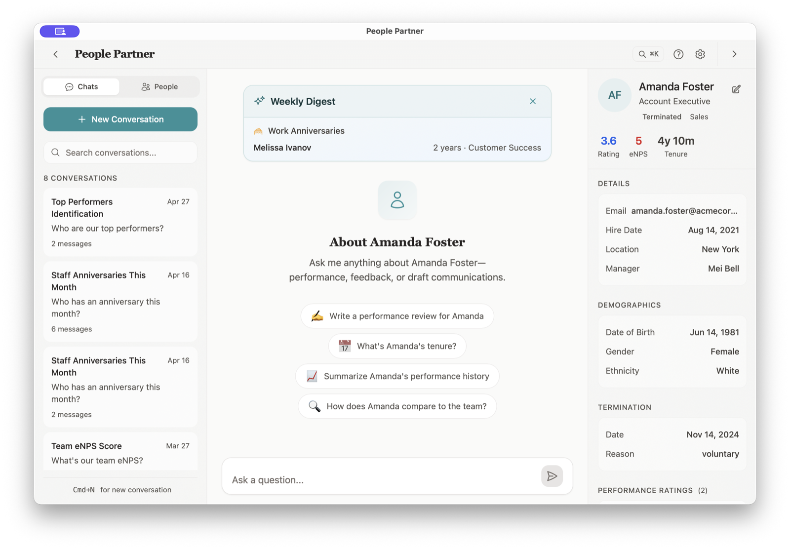

# People Partner

> Your company's HR brain — private, always in context, always ready to help.

[](https://github.com/matthewod11-stack/PeoplePartner/actions/workflows/ci.yml)
[](https://github.com/matthewod11-stack/PeoplePartner/actions/workflows/security.yml)

-lightgrey)


People Partner is a local-first desktop AI assistant for HR professionals. It keeps employee data on your Mac while providing context-aware guidance on policies, compliance, performance, and people decisions.

<p align="center">
  
</p>

**Product site:** [peoplepartner.io](https://peoplepartner.io)

**Source code:** this repository

---

## Product vs. Source Code

People Partner is both a real product and an open-source technical artifact.

- **If you want to use or buy the app**, start at [peoplepartner.io](https://peoplepartner.io). The site has the current download, purchase flow, license delivery, and customer-facing copy.
- **If you are a technical HR builder**, this repo shows how the app is put together. Fork it, learn from it, adapt it, or build your own version.
- **If you are evaluating the project**, judge the product experience from the website and the engineering approach from this repo. They serve different audiences.

The repo is intentionally open source because HR software should be more inspectable, local-first, and builder-friendly than the status quo. The commercial product exists for people who want the finished Mac app and support path.

## What It Does

- **Knows Your Company** — Import employee data and company documents. Get answers that understand your specific context, not generic advice.
- **Remembers Conversations** — References past discussions naturally, building institutional knowledge over time.
- **Protects Sensitive Data** — PII auto-redaction, local-first storage, and local audit trails for supported AI chat interactions.
- **Works Offline** — Browse employees, review past conversations, and access your data even without internet.
- **Experiments with Recruiting Workflows** — Includes early work that brings Sourcerer-style candidate sourcing and scoring concepts into the desktop HR workspace.

## Who It's For

Solo people-ops professionals, founders handling HR themselves, and small HR teams at companies with 10–200 employees. If you've ever Googled an employment law question at 11pm, this is for you.

For builders, it is also a reference implementation for a local-first HR app: Tauri shell, Rust backend, SQLite storage, React UI, bring-your-own-key AI providers, and privacy-conscious AI boundaries.

## Tech Stack

| Layer | Technology |
|-------|------------|
| Framework | [Tauri 2](https://tauri.app/) |
| Frontend | React, TypeScript, Tailwind CSS |
| Backend | Rust, SQLite |
| AI | Multi-provider (Claude, OpenAI, Gemini) — BYOK |
| Platform | macOS (Apple Silicon + Intel) |
| Security | macOS Keychain, PII redaction, encrypted backups |

## Privacy Model

- All app data is stored locally in SQLite on your Mac.
- API keys are stored in macOS Keychain.
- PII redaction runs before sending supported AI requests to a provider.
- Supported AI chat interactions write local audit records; broader backend egress auditing is still being hardened.
- No cloud sync, telemetry, or third-party HR database is required for the desktop app.

## How It's Built

A local-first desktop app with a Rust core and a React shell, built for correctness and privacy over feature sprawl.

- **~39K lines of Rust, ~24K of TypeScript**, with **790 backend tests** exercised in CI on every push.
- **Provider abstraction** (`src-tauri/src/provider.rs`) — Claude, OpenAI, and Gemini sit behind one trait, so the app is model-agnostic and BYOK. Provider resolution is centralized, not hardcoded per call site.
- **PII redaction before egress** (`src-tauri/src/pii.rs`) — financial identifiers (SSN, card, bank) are scanned and redacted before any request leaves the machine, with a local audit trail (`audit.rs`) for supported chat interactions.
- **Secrets in the OS boundary** (`src-tauri/src/keyring.rs`) — API keys live in the macOS Keychain, never in app storage or logs. Licenses are cryptographically signed and verified offline (`license_signing.rs`).
- **Signed, notarized releases** — GitHub Actions builds, code-signs, and notarizes universal macOS binaries (Apple Silicon + Intel) with a pre-notarize entitlements gate; a separate `cargo audit` / RustSec workflow runs on every change.
- **Local-first data** — everything persists in on-device SQLite (SQLx, raw SQL, no ORM); the app is fully usable offline in read-only mode.

## Getting Started as a User

1. Visit [peoplepartner.io](https://peoplepartner.io).
2. Download the free trial or purchase a license.
3. Install the .dmg for your Mac (Apple Silicon or Intel).
4. Activate with your license key, add your AI API key, import employee data, and start asking questions.

## Getting Started as a Builder

```bash
npm install
npm run type-check
npm run tauri:dev
```

Useful commands:

| Command | Purpose |
|---|---|
| `npm run dev` | Run the Vite frontend only |
| `npm run type-check` | Type-check the React/TypeScript frontend |
| `npm run tauri:dev` | Run the full Tauri desktop app in development |
| `npm run tauri:build` | Build the desktop app |

Some app paths depend on macOS-specific services such as Keychain and Tauri desktop APIs. The source is public, but the buyer-ready distribution path lives at [peoplepartner.io](https://peoplepartner.io).

## License

MIT. See [LICENSE](LICENSE) for details.
